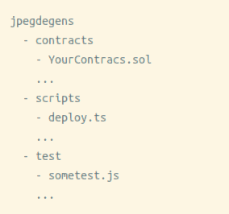

# [COURSE] "A Tour of Web 3: Ethereum and Smart Contracts"

## PDP 1 - Smart contracts

Teacher github user: [ThePrimeagen](https://github.com/ThePrimeagen) | [Github IO of the course](https://theprimeagen.github.io/web3-smart-contracts)

Solidity [official documentation](https://docs.soliditylang.org/en/latest/)

Criptozombies [web page](https://cryptozombies.io/) (school of bloackchain)

### **Course goal: Understand  and interacting with the ethereum blockchain.**

---

## P1. The Foundation

### Typical structure of a solidity project



- contracts: here we found our solidity code
- scripts: code to deploy the contracts
- test: well... test code cowboy xD. `npx hardhat test` will look for this folder

### What is Hardhat?

Its a tool for building and deploying contracts to any ethereum network. Has a lot of nice features with a 3rd party library `ethers` which makes our life easyer.

`npx hardhat compile` will compile all our contracts.

### Our first contract

The contracts are coded in solidity which is the programming language of ethereum. The name of the file it's worthless in the case of hardhat, the important thing here it's the name of the contract inside the file, contract one of the very first line it's the pragma statement: `pragma solidity ^x.x.x`,  set which compiler to use, it's **necesary to set in every contract we make**.

**HINT**: Technically the very first line of our contract should be the license statement `// SPDX-License-Identifier: MIT`

**WARNING NOTE**: Solidity don't user semver, so a major number keept don't necessary means backward compatibility

A contract it's very analog to a class, has a constructor which runs the first time a contract it's deployed to a network, it's a state container which some function to mutate it.

### Testing a contract

1. Setup the test.
2. Deploy our contract on that network.
3. Call our functions to test.

```javascript
// 1. setup
// 2. deploy our contract
// 3. call our functions to test it

// 1.
import _ from "@nomiclabs/hardhat-ethers";
import { ethers } from "hardhat";
import { expect } from "chai";

describe("Hello World", () => {
  it("should get the hello world", async () => {
    // 2.
    // This next line creates a eth network, deploy the contrac on it, and the shut down the netwokr
    const HelloWorld = await ethers.getContractFactory("HelloWorld" /* CONTRACT name, not the file */);
    const hello = await HelloWorld.deploy();
    // await to our contract finally deploys
    await hello.deployed()

    // 3.
    // Runs the test
    expect(await hello.hello()).to.equal("Hello, World");
  });
});
```

### Deploying a contract

The script to deploy a contract it's pretty equals the use in the test, once the script it's performed to deploy with hardhat we need to execute: `npx hardhat run script/deploy-script.ts --network localhost` **the network flag it's pretty**  important

### Connecting a website to metamask

Metamask abstract how to contact the network and ethers knows how to use it.

```typescript
import { ethers } from "ethers";
// This is the json generated by hardhat with information about the contract
import SomeContractJSON from '../artifacts/contracts/Bids.sol/Bids.json'

function getEth() {
  // @ts-ignore
  const eth = window.ethereum;
  if (!eth) {
    throw new Error("Get metamask");
  }
  return eth;
}

async function hasAccounts() {
  const eth = getEth();
  const accounts = await eth.request({ method: 'eth_accounts' }) as string[];

  return accounts && accounts.length;
}

async function requestAccounts() {
  const eth = getEth();
  const accounts = await eth.request({ method: 'eth_requestAccounts' }) as string[];

  return accounts && accounts.length;
}

async function connect() {
  if (!await hasAccounts() && ! await requestAccounts()) {
    throw new Error('Please, let me access metamask');
  }

  const myContract = new ethers.Contract(
    '0x5fbdb2315678afecb367f032d93f642f64180aa3', // Address or name, better on process.env 
    SomeContractJSON.abi, // Contract interface
    new ethers.providers.Web3Provider(getEth())/* To here, just provider */
      .getSigner() //Signer
  );

  ...
}
```

---

## P2. Understanding Solidity

### - if

```solidity
if (/* boolean expr */) {
  ...
} else if (...) {
  ...
} else {
  ...
}
```

### - loops

```solidity
for (uint256 i = 0; i < 10; ++i) {
  ...
}
```

### - contracts

```solidity
contract Name {
  ...
  uint foo = 5; // = to 'uint256 foo'
  constructor() {
    // I am called once at contract deploy
  }

  function name() scope returns(type) {
    ...
  }
}
```

### - types

#### base types

uint = 256 bit number uint8, uint16, uint32, ...

strings suck

#### arrays

Could be dynamic and static

```solidity
contract Foo {
  uint[] foo; // Hello I am dynamic
  function foofoo() public view {
    uint[] fooo = new uint[](10); // I am fixed array
  }
}
```

#### mappings

these are much different. You cannot iterate

```solidity
contract Foo {
    mapping(uint => address[]) mymap;
}
```

#### structs

Just like C

```solidity
struct Foo {
    uint a;
    uint16 b;
    uint8 c;
}
mapping(uint => Foo) mymap;
Foo[] myarr;
```

### - `view`, `pure` and `payable` functions and scopes of a function

- `view`: functions which only reads from the contract but don't change it at all.
- `pure`: functions cannot read or write the contract
- `payble`: functions can accept money on it

|                     | public| private| internal| external|
| ------------------- | :---: | :----: | :-----: | :-----: |
| contract can call   | yes   | yes    | yes     | no      |
| subcontrat can call | yes   | no     | yes     | no      |
| outside can call    | yes   | no     | no      | yes     |

### - events

```solidity
contract MyContract {
  ...
  event MyEvent(uint256 value);
  // To send an event to who call our contract:
  event MyPersonalEvent(address indexed addr, uint256 value)

  function myFunction() public {
    ...
    emit MyEvent(value);
    // To emit an event ONLY to  who call our contract:
    emit MyPersonalEvent(msg.sender, value)
  }
  ...
}
```

To listen for the event in our FE:

```javascript
deployedContract.on(deployedContract.filter.MyEvent(), function(value) { ... });
```

---

## P3. Complex Contract

### - enum

```solidity
contract MyContract {
  enum MyEnum {e1, e2, e3}
}
```

- Cons: we can not decide the value of each individual enum.
- Pros: If we use an emun as a function argument the function couldn't be called with a valid enum.

### - ether

Used in a contract to compare etherum values

```solidity
0.05 ether // I'm 0.05 ethereum! 
msg.value > 0.123 ether // money received in the call be greater than .123 ethereum
```

### - msg

it's a contract global object hta allow us to access information about the transaction, their interface is:

```solidity
{
  data,
  ether gas,
  address sender,
  sig,
  ether value
}
```

### - require

it's like an assert, allows us to assert things, if someone don't assert, the contract call reverts automatically.

```solidity
contract MyContract {
  function f() public payable {
    require(/* bool condition*/, "please match the condition");
  }
}
```

### - `memory` and `storage`

- `memory`: refers to memory of the function call
- `storage`: ferers to memory of the contract

### - MAXIMUM contract size

A contract can only have 24kb

---

## P4. Solve the needing to update your contract

### Diamond Pattern

This pattern cames to solve the limit of contract weight and the issue to deploy a new contract and loose all the money on the previous one.

So, to solve this cames the EIP-2535 (Ethereum Improvemnt Proposal), a diamond in a basic way it's a contract wich stores links to other contracts and stores the memory of the program, the Diamond contract execute the contractrs related to him on context of himself.

3 key concepts:

- Fallbacks: special funtions which run in case the called method don't exists.
- Delegate calls: call another contract method on context of another contract.
- Storage/Layout

#### Print storage of a contract

```solidity
ethers.provider.getStorageAt(contractAddress, storageIndexToPrint)
```

---

## Q, A and Hints

### QA: what `hardhat.config.ts` file is?

Drives all our hardhat experience

- `solidity` prop set the compilers we are abailable to use
- `networks` object with config the connection to blockchain network, all it's props are names we assign to the network. So, inside a network we have:
  - `chainId`: identification to avoid hit a wrong network

### QA: How to setup a localhost eth network?

Simply: `npm hardhat node` this will setup our localhost eth and create some (20) accounts with 10000eth to test anything.

### QA: How to add a new network to hardhat?

Hardhat config file,

### QA: What is GAS?

A kind of tax the network fee to process our transaction

### QA: Types of calls in the network

- Those who cost GAS: Any request which modify the state of the blockchain request GAS
- Those who don't: If the call don't modify the blockchain, it don't cost GAS (`pure` of `view` functions)

So simply.

### QA: How to upgrade a function once deployed to network?

It's imposible, once the contract it's deployed it's unmutable, we can only store things on it, and if we deploy again our contract we loose all the information on the first one.

There are workarrounds (Diamond patter).

### Hint: `Nounce too high` error

Metamask cna throw this error time to time, it's because strat new eth network and metamask expect changes we did previously, to avoid this error: `metamask->profile button->settings->advanced->Reset account`

### QA: What BigNumber is?

it's an special type to handle the uint256 bit in javascript, we can do operations with this special type. [Reference](https://docs.ethers.io/v5/api/utils/bignumber)

### Hint: [Opcodes and Instruction Gas Cost Reference](https://github.com/crytic/evm-opcodes)

### Hint: [Gas reporter](https://www.npmjs.com/package/hardhat-gas-reporter) to mesure gas cost of transactions

### Hint: to save money we need to find the way to do the less possible changes in the chain (heroes example in the course)
